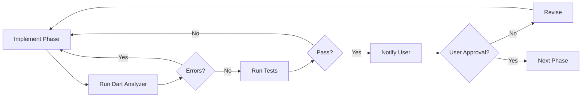

# Phased Execution Workflow

**Version**: 1.0.0  
**Last Updated**: February 17, 2026

## Overview

This document defines the **phased execution strategy** for implementing features in the Miqotul Khoir TV (MKT) project. Each phase is executed incrementally with testing and user approval gates.

## Core Principles

1. **Incremental Delivery**: Break features into small, testable phases
2. **Checkpoint Gates**: Verify quality before proceeding
3. **User Approval**: Get explicit confirmation before next phase
4. **Fail Fast**: Catch issues early with continuous testing

## Workflow Diagram



## Phase Structure

### Standard Phases

| Phase | Focus | Typical Tasks |
|-------|-------|---------------|
| **Phase 1** | Setup | State variables, imports, configuration |
| **Phase 2** | Logic | Business logic, data fetching, processing |
| **Phase 3** | UI | Widget implementation, layout, styling |
| **Phase 4** | Polish | UX enhancements, edge cases, accessibility |

### Checkpoint Gates

After each phase, execute these verification steps:

```bash
# 1. Static Analysis
dart analyze lib/path/to/feature/

# 2. Run Tests
flutter test --reporter=expanded

# 3. Visual Verification (if UI phase)
flutter run  # Manual check on device/emulator
```

## Implementation Guide

### Planning Document Template

Add this section to your `plan/feature-*.md`:

```markdown
## Execution Strategy

> [!IMPORTANT]
> Implementasi dilakukan secara bertahap. Setiap fase diikuti dengan testing 
> dan user approval sebelum melanjutkan ke fase berikutnya.

### Checkpoint Gates Summary

| Phase | Deliverables | Verification | User Decision |
|-------|--------------|--------------|---------------|
| **Phase 1** | State setup | `dart analyze` | ❓ Continue? |
| **Phase 2** | Core logic | `dart analyze` + tests | ❓ Continue? |
| **Phase 3** | UI implementation | Visual test | ❓ Continue? |
| **Phase 4** | UX polish | All tests pass | ✅ Done |
```

### Per-Phase Notes

Add checkpoint notes after each phase in the planning document:

```markdown
> [!NOTE]
> **Checkpoint Gate N**: Setelah Phase N selesai, jalankan `dart analyze` 
> dan tanyakan user apakah ingin lanjut ke Phase N+1.
```

## Communication Protocol

### After Each Phase

1. **Report Deliverables**: List what was implemented
2. **Show Test Results**: Include `dart analyze` output
3. **Ask for Approval**: "Lanjut ke Phase N+1?"

### User Response Options

| Response | Action |
|----------|--------|
| "Ya" / "Lanjut" | Proceed to next phase |
| "Tidak" / "Revisi" | Make requested changes |
| "Stop" | Pause implementation |

## Benefits

- **Reduced Risk**: Issues caught early before cascading
- **Better Control**: User can pause or adjust at any checkpoint
- **Clear Progress**: Visible milestones and completion status
- **Quality Gates**: No phase proceeds without passing tests

## Related Documents

- [Testing Guide](TESTING_GUIDE.md) - Testing strategies
- [Development Workflow](DEVELOPMENT_WORKFLOW.md) - Git and CI/CD
- [Architecture Patterns](ARCHITECTURE_PATTERNS.md) - Code patterns
