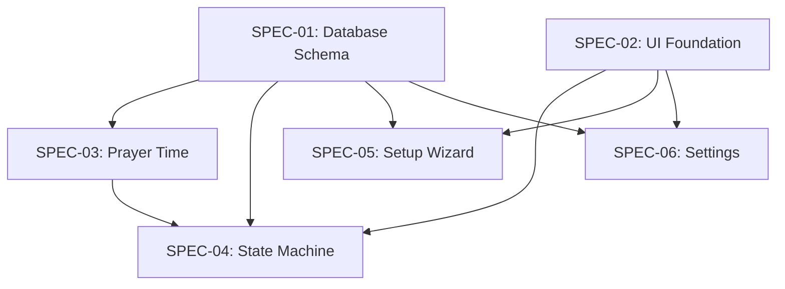

# Specification Overview — Miqotul Khoir TV

Dokumen ini merangkum **6 Technical Specifications** yang menjadi blueprint teknis
aplikasi MKT. Semua spec berada di folder `spec/` dan disusun berdasarkan
domain boundary dengan dependency yang jelas antar spec.

## Status: ✅ Semua Spec Selesai (v1.0)

## Dependency Map

## Spec Index

### Foundation Layer (Tidak saling bergantung)

| Spec | File | Scope |
|------|------|-------|
| **SPEC-01** | [`spec-schema-database.md`](../spec/spec-schema-database.md) | SQLite schema (`settings` + `cities`), repository pattern, migration strategy, data seeding |
| **SPEC-02** | [`spec-design-ui-foundation.md`](../spec/spec-design-ui-foundation.md) | Islamic Glassmorphism theme, ScreenUtil config, typography scale, D-Pad navigation, layout grid |

### Core Business Logic

| Spec | File | Scope | Depends On |
|------|------|-------|------------|
| **SPEC-03** | [`spec-process-prayer-time.md`](../spec/spec-process-prayer-time.md) | `adhan-dart` integration, 7 waktu sholat, Ihtiyat, Hijri conversion | SPEC-01 |
| **SPEC-04** | [`spec-process-state-machine.md`](../spec/spec-process-state-machine.md) | 5-state transitions, timer management, power recovery | SPEC-01, SPEC-02, SPEC-03 |

### Application Features

| Spec | File | Scope | Depends On |
|------|------|-------|------------|
| **SPEC-05** | [`spec-process-setup-wizard.md`](../spec/spec-process-setup-wizard.md) | 4-step first-run wizard, city picker, coordinate input, preview | SPEC-01, SPEC-02 |
| **SPEC-06** | [`spec-process-settings.md`](../spec/spec-process-settings.md) | Settings menu, PIN protection, Ihtiyat stepper, running text, auto-save | SPEC-01, SPEC-02 |

## Key Design Decisions

| Decision | Detail | Spec |
|----------|--------|------|
| **Singleton Row** | `settings` table selalu 1 row (`id = 1`, enforced via `CHECK`) | SPEC-01 |
| **No Foreign Keys** | Simplified schema untuk embedded system — copy values, bukan FK reference | SPEC-01 |
| **Dhuha Terpisah** | Dihitung dari `Syuruq + offset` karena `adhan` tidak menyediakan Dhuha | SPEC-03 |
| **Pure Function State Eval** | State evaluation deterministic — input `DateTime` + prayers → output state | SPEC-04 |
| **Polling Timer** | 1-second tick untuk evaluate state (bukan event-driven) — simpler + power recovery | SPEC-04 |
| **Auto-Save Settings** | Setiap perubahan setting langsung persist ke database — no "Save" button | SPEC-06 |
| **PIN via D-Pad** | Up/Down ganti digit, Left/Right pindah posisi — no keyboard needed | SPEC-06 |

## Coverage Summary

| Metric | Count |
|--------|:-----:|
| Total Acceptance Criteria | 65 |
| Total Required Tests | 64 |
| Domain Entities | 5 (Settings, City, PrayerTime, DailyPrayerTimes, SetupWizardData) |
| Cubits | 4 (PrayerTime, DisplayState, SetupWizard, Settings) |
| Repository Interfaces | 2 (Settings, City) |
| Use Cases | 2 (CalculatePrayerTimes, EvaluateDisplayState) |

## Recommended Execution Order

Sesuai dependency + SDLC workflow (**Plan → Code → Test** per spec):

| Urutan | Spec | Bisa Paralel? |
|:------:|------|:-------------:|
| 1a | SPEC-01: Database Schema | ✅ dengan 1b |
| 1b | SPEC-02: UI Foundation | ✅ dengan 1a |
| 2 | SPEC-03: Prayer Time | — |
| 3 | SPEC-04: State Machine | — |
| 4a | SPEC-05: Setup Wizard | ✅ dengan 4b |
| 4b | SPEC-06: Settings | ✅ dengan 4a |

## Cara Membaca Setiap Spec

Setiap spec document mengikuti struktur yang konsisten:

1. **Introduction** — Konteks dan purpose
2. **Purpose & Scope** — Batasan jelas apa yang di-cover dan tidak
3. **Definitions** — Glossary istilah teknis
4. **Requirements, Constraints & Guidelines** — REQ/CON/GUD/PAT codes
5. **Interfaces & Data Contracts** — Entity, Cubit, Use Case, file structure
6. **Acceptance Criteria** — AC codes untuk validasi
7. **Test Automation Strategy** — TEST codes dan coverage target
8. **Rationale & Context** — Alasan di balik design decisions
9. **Dependencies** — Internal dan external dependencies
10. **Examples & Edge Cases** — Code examples dan corner cases
