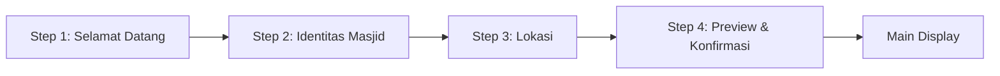

# Introduction

Spesifikasi ini mendefinisikan flow Setup Wizard (First Run Experience) untuk aplikasi Miqotul Khoir TV. Wizard ini muncul hanya saat pertama kali aplikasi dijalankan (`is_first_run = 1`) dan memandu admin DKM melalui 4 langkah konfigurasi awal.

Setelah wizard selesai, flag `is_first_run` diset ke `0` dan pengguna langsung diarahkan ke Main Display.

## 1. Purpose & Scope

### Purpose

Memandu admin DKM mengkonfigurasi identitas masjid, lokasi, dan memverifikasi jadwal sholat saat pertama kali menjalankan aplikasi.

### Scope

- 4-step wizard flow
- Step 1: Selamat Datang + cek waktu sistem
- Step 2: Identitas masjid (nama, alamat)
- Step 3: Lokasi (city picker preset ATAU input manual koordinat)
- Step 4: Preview jadwal sholat + konfirmasi
- City search/filter mechanism
- Navigation D-Pad antar step
- Validation per step

### Out of Scope

- Time correction / Ihtiyat (ditangani oleh SPEC-06: Settings)
- Iqomah timing config (ditangani oleh SPEC-06)
- PIN setup (ditangani oleh SPEC-06)

## 2. Definitions

| Term | Definition |
|------|-----------|
| **First Run** | Kondisi `is_first_run = 1` di database — wizard belum pernah diselesaikan |
| **City Picker** | UI untuk memilih kota/kabupaten dari database preset |
| **Manual Coordinates** | Input latitude/longitude secara manual oleh admin |
| **Step Indicator** | Visual yang menunjukkan posisi step saat ini (progress bar / dots) |

## 3. Requirements, Constraints & Guidelines

### Requirements

- **REQ-001**: Wizard hanya muncul ketika `is_first_run = 1`
- **REQ-002**: Wizard terdiri dari 4 step yang harus diselesaikan secara berurutan
- **REQ-003**: Setiap step harus memiliki validasi — tidak bisa lanjut jika data tidak valid
- **REQ-004**: Step 1 menampilkan pesan selamat datang dan mengingatkan admin untuk mengecek waktu sistem
- **REQ-005**: Step 2 mengumpulkan nama masjid (wajib) dan alamat masjid (opsional)
- **REQ-006**: Step 3 menyediakan 2 tab: (A) Pilih kota dari preset, (B) Input koordinat manual
- **REQ-007**: City picker harus mendukung search (filter by nama kota)
- **REQ-008**: Step 4 menampilkan preview jadwal 7 waktu sholat berdasarkan lokasi terpilih
- **REQ-009**: Setelah konfirmasi di Step 4, data disimpan ke database dan `is_first_run = 0`
- **REQ-010**: Navigasi antar step menggunakan tombol "Lanjut" dan "Kembali" yang focusable via D-Pad
- **REQ-011**: Navigasi "Kembali" tersedia di semua step kecuali Step 1

### Constraints

- **CON-001**: Tidak boleh ada "Skip" — semua step harus diselesaikan
- **CON-002**: Data hanya di-commit ke database di Step 4 (bukan per-step)
- **CON-003**: City search harus responsif (< 100ms untuk query LIKE)
- **CON-004**: Semua input harus navigable via D-Pad (no touch)

### Guidelines

- **GUD-001**: Step indicator di bagian atas menunjukkan progress (1/4, 2/4, dst)
- **GUD-002**: Gunakan gold accent untuk tombol "Lanjut" (primary action)
- **GUD-003**: Tampilkan toast/inline error jika validasi gagal (jangan dialog)
- **GUD-004**: City picker list menggunakan `ListView` yang focusable per item

## 4. Interfaces & Data Contracts

### 4.1. Wizard Flow



### 4.2. Step Details

#### Step 1: Selamat Datang

| Item | Detail |
|------|--------|
| **Title** | "Selamat Datang di Miqotul Khoir TV" |
| **Content** | Deskripsi singkat aplikasi + reminder cek waktu sistem |
| **Display** | Current system time (large clock) agar admin bisa verifikasi |
| **Action** | Tombol "Mulai Setup" |
| **Validation** | Tidak ada — informational only |

#### Step 2: Identitas Masjid

| Item | Detail |
|------|--------|
| **Field 1** | Nama Masjid (`TextField`, wajib, max 100 char) |
| **Field 2** | Alamat Masjid (`TextField`, opsional, max 200 char) |
| **Action** | Tombol "Lanjut" + "Kembali" |
| **Validation** | Nama masjid tidak boleh kosong, min 3 karakter |

#### Step 3: Lokasi

| Item | Detail |
|------|--------|
| **Tab A** | City Picker (pilih dari daftar kota preset) |
| **Tab B** | Manual Input (latitude + longitude text fields) |
| **City Picker** | Dropdown/list provinsi → list kota (filtered) |
| **Search** | Text field untuk filter nama kota (case-insensitive) |
| **Manual Input** | Latitude (-11 s/d 6) dan Longitude (94 s/d 141) |
| **Action** | Tombol "Lanjut" + "Kembali" |
| **Validation** | Tab A: kota harus dipilih. Tab B: lat/lng dalam range Indonesia |

**Tab A Flow:**
```
1. Pilih Provinsi (dropdown/list, sorted alphabetically)
   → Load semua kota dalam provinsi terpilih
2. Pilih Kota (list, sorted alphabetically)
   → Auto-fill lat/lng dari data kota
   
Alternatif: Search field untuk filter kota langsung (tanpa pilih provinsi dulu)
```

**Tab B Validation:**
```
Latitude : -11.0 ≤ lat ≤ 6.0  (range wilayah Indonesia)
Longitude: 94.0 ≤ lng ≤ 141.0 (range wilayah Indonesia)
Format   : decimal degrees (contoh: -6.9175)
```

#### Step 4: Preview & Konfirmasi

| Item | Detail |
|------|--------|
| **Display** | Nama masjid, lokasi terpilih, jadwal 7 waktu sholat hari ini |
| **Calculation** | Menggunakan SPEC-03 `CalculatePrayerTimesUseCase` dengan lokasi terpilih |
| **Action** | Tombol "Konfirmasi & Mulai" + "Kembali" |
| **On Confirm** | Save semua data ke `settings` table, set `is_first_run = 0` |

### 4.3. Cubit States

```dart
/// presentation/cubits/setup_wizard/setup_wizard_state.dart
abstract class SetupWizardState extends Equatable {}

class SetupWizardInitial extends SetupWizardState {}

/// Active wizard step
class SetupWizardStep extends SetupWizardState {
  final int currentStep; // 1-4
  final SetupWizardData data; // Accumulated data from previous steps
  final String? validationError; // Inline error message, null if valid
}

/// Wizard completing (saving to database)
class SetupWizardSaving extends SetupWizardState {}

/// Wizard complete — navigate to main display
class SetupWizardComplete extends SetupWizardState {}

/// Error during save
class SetupWizardError extends SetupWizardState {
  final String message;
}
```

### 4.4. Wizard Data Model

```dart
/// presentation/cubits/setup_wizard/setup_wizard_data.dart
class SetupWizardData extends Equatable {
  final String mosqueName;
  final String mosqueAddress;
  final String cityName;
  final double? latitude;
  final double? longitude;
  final bool isManualCoordinates; // Tab A (false) or Tab B (true)

  const SetupWizardData({
    this.mosqueName = '',
    this.mosqueAddress = '',
    this.cityName = '',
    this.latitude,
    this.longitude,
    this.isManualCoordinates = false,
  });

  SetupWizardData copyWith({...});
}
```

### 4.5. Cubit

```dart
/// presentation/cubits/setup_wizard/setup_wizard_cubit.dart
class SetupWizardCubit extends Cubit<SetupWizardState> {
  final SettingsRepository _settingsRepository;
  final CityRepository _cityRepository;
  final CalculatePrayerTimesUseCase _calculatePrayerTimes;

  /// Mulai wizard dari Step 1
  void startWizard();

  /// Lanjut ke Step berikutnya dengan data terkini
  void nextStep(SetupWizardData data);

  /// Kembali ke Step sebelumnya
  void previousStep();

  /// Validasi data per step, return error message or null
  String? validateStep(int step, SetupWizardData data);

  /// Konfirmasi dan simpan ke database
  Future<void> completeWizard(SetupWizardData data);
}
```

### 4.6. File Structure

```
lib/
├── presentation/
│   ├── cubits/
│   │   └── setup_wizard/
│   │       ├── setup_wizard_cubit.dart
│   │       ├── setup_wizard_state.dart
│   │       └── setup_wizard_data.dart
│   └── pages/
│       └── setup_wizard/
│           ├── setup_wizard_page.dart      # Main wizard container
│           ├── step_welcome.dart            # Step 1
│           ├── step_mosque_identity.dart    # Step 2
│           ├── step_location.dart           # Step 3 (with Tab A/B)
│           └── step_preview.dart            # Step 4
```

## 5. Acceptance Criteria

- **AC-001**: Given `is_first_run = 1`, When app starts, Then SetupWizardPage is shown instead of MainDisplay
- **AC-002**: Given `is_first_run = 0`, When app starts, Then MainDisplay is shown directly (wizard skipped)
- **AC-003**: Given Step 2 with empty mosque name, When "Lanjut" is pressed, Then validation error is shown and step does not advance
- **AC-004**: Given Step 2 with valid mosque name, When "Lanjut" is pressed, Then step advances to Step 3
- **AC-005**: Given Step 3 Tab A, When user selects province "Jawa Barat", Then cities in Jawa Barat are listed
- **AC-006**: Given Step 3 Tab A search field, When user types "band", Then list is filtered to show "Bandung", "Bandung Barat"
- **AC-007**: Given Step 3 Tab B with latitude -6.9175, longitude 107.6191, When "Lanjut" is pressed, Then step advances to Step 4
- **AC-008**: Given Step 3 Tab B with latitude 50.0 (out of Indonesia range), When "Lanjut" is pressed, Then validation error is shown
- **AC-009**: Given Step 4, When page renders, Then preview shows 7 prayer times for today using selected location
- **AC-010**: Given Step 4, When "Konfirmasi & Mulai" is pressed, Then data is saved to `settings` table, `is_first_run = 0`, and app navigates to MainDisplay
- **AC-011**: Given any step > 1, When "Kembali" is pressed, Then wizard returns to previous step with data preserved
- **AC-012**: Given all steps, When navigating with D-Pad, Then all interactive elements are focusable and navigable

## 6. Test Automation Strategy

### Required Tests

- **TEST-001**: `SetupWizardCubit.startWizard()` emits step 1
- **TEST-002**: `SetupWizardCubit.nextStep()` with valid data advances to next step
- **TEST-003**: `SetupWizardCubit.nextStep()` with invalid data emits validation error
- **TEST-004**: `SetupWizardCubit.previousStep()` goes back with data preserved
- **TEST-005**: `SetupWizardCubit.completeWizard()` saves to database and emits complete
- **TEST-006**: `validateStep(2, ...)` rejects empty mosque name
- **TEST-007**: `validateStep(3, ...)` rejects out-of-range coordinates
- **TEST-008**: City search returns filtered results correctly

## 7. Rationale & Context

### Mengapa 4 Step?

4 step memberikan keseimbangan antara:
- Cukup granular untuk memandu admin step-by-step
- Tidak terlalu banyak sehingga membosankan
- Setiap step memiliki purpose yang jelas

### Mengapa Data Hanya Di-Save di Step 4?

Atomic save di akhir memastikan:
- Tidak ada partial state jika wizard dibatalkan (misalnya power loss)
- Database selalu dalam kondisi konsisten
- Rollback natural — cukup tidak save

### Mengapa Latitude/Longitude Range Indonesia Saja?

Aplikasi didesain untuk masjid di Indonesia. Validating range coordinates:
- Mencegah typo yang drastis
- Latitude Indonesia: -11° (Pulau Rote) sampai 6° (Pulau Weh)
- Longitude Indonesia: 94° (Sabang) sampai 141° (Merauke)

## 8. Dependencies & External Integrations

### Internal Dependencies

- **INT-001**: SPEC-01 `SettingsRepository` — Save wizard results
- **INT-002**: SPEC-01 `CityRepository` — City picker data
- **INT-003**: SPEC-03 `CalculatePrayerTimesUseCase` — Preview prayer times di Step 4
- **INT-004**: SPEC-02 UI Foundation — FocusableWidget, GlassmorphismCard, D-Pad nav

## 9. Examples & Edge Cases

### Edge Case: Power Loss di Tengah Wizard

```dart
// Wizard data belum di-save → is_first_run tetap 1
// Saat app restart → wizard muncul lagi dari Step 1
// User harus ulang input → acceptable karena wizard hanya sekali
```

### Edge Case: Keyboard Input di Android TV

```dart
// Android TV bisa menampilkan on-screen keyboard saat TextField fokus
// Alternatif: gunakan remote virtual keyboard dari Android TV system
// Pastikan TextField support D-Pad input + Enter untuk submit
```

## 10. Validation Criteria

- [ ] Wizard hanya muncul saat `is_first_run = 1`
- [ ] Navigasi maju/mundur berfungsi dengan D-Pad
- [ ] Validasi per step mencegah data invalid
- [ ] City picker search responsif dan akurat
- [ ] Preview jadwal sholat sesuai lokasi terpilih
- [ ] Data tersimpan atomik di Step 4
- [ ] Setelah complete, main display langsung muncul

## 11. Related Specifications / Further Reading

- [PRD §3.5 — Initial Setup Flow](file:///d:/AndroidProject/LatihanFlutter/sadayana_masjid_tv/Product_Requirement_Document.md)
- SPEC-01: Database Schema — `settings` table, `cities` table
- SPEC-03: Prayer Time — Use case untuk preview di Step 4
- SPEC-02: UI Foundation — D-Pad navigation dan UI components
