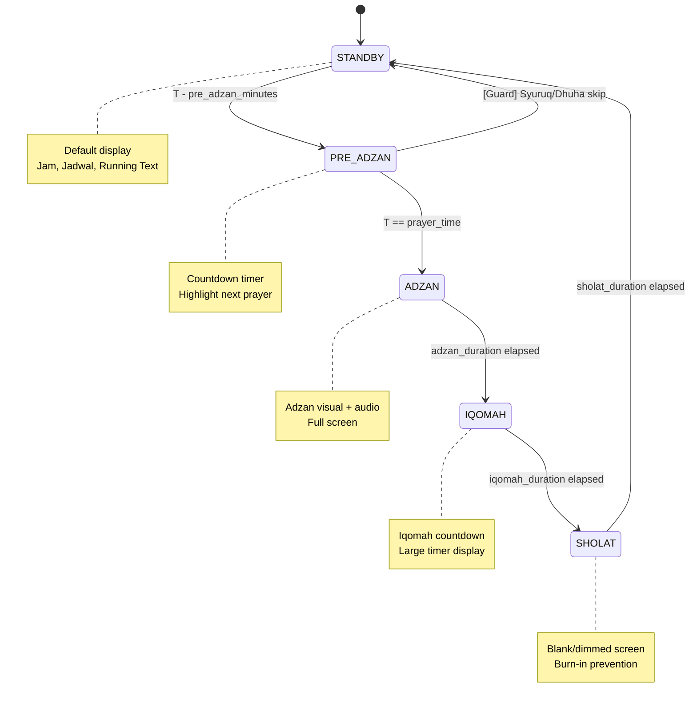

# Introduction

Spesifikasi ini mendefinisikan State Machine untuk display logic utama aplikasi Miqotul Khoir TV. Aplikasi memiliki **5 state** yang bertransisi secara otomatis berdasarkan waktu sholat, menciptakan pengalaman digital signage yang fully automated tanpa intervensi user.

Ini adalah pattern paling complex di aplikasi — mengoordinasikan prayer times, timers, UI layouts, dan audio triggers.

## 1. Purpose & Scope

### Purpose

Mendefinisikan 5 state display, transition rules, timer management, dan UI layout contracts agar display otomatis berganti sesuai jadwal sholat.

### Scope

- 5 display states dan transition logic
- Timer management (countdown Pre-Adzan, Iqomah, durasi Sholat)
- Per-state UI layout contracts
- Audio trigger interface (Adzan state)
- Power loss recovery (state restoration)
- Cubit state management (`DisplayStateCubit`)

### Out of Scope

- Kalkulasi waktu sholat (ditangani oleh SPEC-03)
- UI component implementation detail (ditangani oleh SPEC-02)
- Audio file management (future spec)

## 2. Definitions

| Term | Definition |
|------|-----------|
| **State Machine** | Pattern di mana aplikasi berada di salah satu dari sejumlah state terbatas dan bertransisi berdasarkan events |
| **STANDBY** | State default menampilkan semua informasi (jam, jadwal, running text) |
| **PRE-ADZAN** | State countdown H-10 menit (configurable) sebelum waktu sholat |
| **ADZAN** | State saat waktu sholat masuk (adzan berkumandang) |
| **IQOMAH** | State countdown menuju sholat berjamaah |
| **SHOLAT** | State blank/dimmed screen saat sholat berlangsung |
| **Trigger** | Kondisi yang menyebabkan transition dari satu state ke state lain |
| **Guard** | Kondisi tambahan yang harus terpenuhi agar transition terjadi |

## 3. Requirements, Constraints & Guidelines

### Requirements

- **REQ-001**: Aplikasi memiliki tepat 5 state: STANDBY, PRE_ADZAN, ADZAN, IQOMAH, SHOLAT
- **REQ-002**: Transition antar state terjadi otomatis berdasarkan waktu — tidak ada input user required
- **REQ-003**: Pre-Adzan countdown dimulai H-`pre_adzan_minutes` menit sebelum waktu sholat (configurable, default 10)
- **REQ-004**: Adzan memiliki durasi `adzan_duration_seconds` (configurable, default 180 detik)
- **REQ-005**: Iqomah countdown duration berbeda per waktu sholat (configurable via `iqomah_*` fields)
- **REQ-006**: Sholat state berlangsung selama `sholat_duration_minutes` (configurable, default 15 menit)
- **REQ-007**: Setelah Sholat state berakhir, kembali ke STANDBY
- **REQ-008**: State machine harus bisa recover dari power loss — restore ke state yang tepat berdasarkan waktu saat ini
- **REQ-009**: Syuruq dan Dhuha TIDAK memiliki cycle Pre-Adzan → Adzan → Iqomah → Sholat (hanya 5 waktu sholat fardhu)
- **REQ-010**: Setiap state memiliki UI layout yang berbeda

### Constraints

- **CON-001**: State transition loop per tick (setiap detik) — polling, bukan event-driven
- **CON-002**: Hanya satu state aktif pada satu waktu
- **CON-003**: Transition selalu maju (STANDBY → PRE_ADZAN → ADZAN → IQOMAH → SHOLAT → STANDBY), tidak bisa mundur
- **CON-004**: Timer harus di-dispose saat Cubit `close()` — tidak boleh ada memory leak

### Guidelines

- **GUD-001**: Gunakan periodic `Timer` (1 detik interval) untuk state evaluation
- **GUD-002**: State evaluation logic harus pure function — menerima `DateTime.now()` dan prayer times, mengembalikan state
- **GUD-003**: Pisahkan state evaluation logic dari Cubit untuk testability

### Patterns

- **PAT-001**: State Machine Pattern — finite states with deterministic transitions
- **PAT-002**: Cubit Pattern — `DisplayStateCubit` emit immutable states
- **PAT-003**: Timer Management — centralized timer lifecycle in Cubit

## 4. Interfaces & Data Contracts

### 4.1. State Diagram



### 4.2. Transition Rules Detail

| # | From | To | Trigger | Guard |
|:-:|------|-----|---------|-------|
| T1 | STANDBY | PRE_ADZAN | `now >= prayer.displayTime - pre_adzan_minutes` | Prayer is fardhu (bukan Syuruq/Dhuha) |
| T2 | PRE_ADZAN | ADZAN | `now >= prayer.displayTime` | — |
| T3 | ADZAN | IQOMAH | `elapsed >= adzan_duration_seconds` | — |
| T4 | IQOMAH | SHOLAT | `countdown == 0` | — |
| T5 | SHOLAT | STANDBY | `elapsed >= sholat_duration_minutes` | — |
| T6 | ANY | STANDBY | Power recovery + no active prayer cycle | State recovery |

### 4.3. Waktu Sholat yang Memiliki Cycle

| Waktu | Has Cycle? | Iqomah Duration |
|-------|:----------:|:---------------:|
| Subuh | ✅ | `iqomah_subuh` (default 10m) |
| Syuruq | ❌ | — |
| Dhuha | ❌ | — |
| Dzuhur | ✅ | `iqomah_dzuhur` (default 10m) |
| Ashar | ✅ | `iqomah_ashar` (default 10m) |
| Maghrib | ✅ | `iqomah_maghrib` (default 7m) |
| Isya | ✅ | `iqomah_isya` (default 10m) |

### 4.4. Cubit States

```dart
/// presentation/cubits/display_state/display_state.dart
abstract class DisplayState extends Equatable {
  const DisplayState();
}

class StandbyState extends DisplayState {
  final DateTime currentTime;
  final DailyPrayerTimes prayerTimes;
  final String runningText;
  final String mosqueName;
  final String mosqueAddress;
  final String hijriDate;
}

class PreAdzanState extends DisplayState {
  final PrayerTime nextPrayer;
  final Duration remainingTime;
  final DailyPrayerTimes prayerTimes; // Masih tampilkan jadwal
}

class AdzanState extends DisplayState {
  final PrayerTime currentPrayer;
  final Duration elapsed; // Untuk progress indicator
  final Duration totalDuration;
}

class IqomahState extends DisplayState {
  final PrayerTime currentPrayer;
  final Duration remainingTime;
}

class SholatState extends DisplayState {
  final PrayerTime currentPrayer;
  final DateTime endTime;
}
```

### 4.5. Cubit

```dart
/// presentation/cubits/display_state/display_state_cubit.dart
class DisplayStateCubit extends Cubit<DisplayState> {
  final PrayerTimeCubit _prayerTimeCubit;
  final SettingsRepository _settingsRepository;

  Timer? _tickTimer;       // 1-second periodic timer
  Timer? _stateTimer;      // Timer untuk current state duration (adzan, sholat)

  DisplayStateCubit({
    required PrayerTimeCubit prayerTimeCubit,
    required SettingsRepository settingsRepository,
  });

  /// Initialize state machine — start tick timer
  void initialize();

  /// Evaluate current state berdasarkan waktu sekarang
  /// Pure function logic — dipanggil setiap tick
  DisplayState evaluateState(DateTime now, DailyPrayerTimes prayers, Settings settings);

  /// Handle transition ke state baru
  void _transitionTo(DisplayState newState);

  @override
  Future<void> close() {
    _tickTimer?.cancel();
    _stateTimer?.cancel();
    return super.close();
  }
}
```

### 4.6. State Evaluation Logic (Pure Function)

```dart
/// domain/usecases/evaluate_display_state_use_case.dart
class EvaluateDisplayStateUseCase {
  /// Determine display state berdasarkan waktu dan prayer schedule
  ///
  /// Returns the appropriate DisplayState for the given moment.
  /// This is a PURE FUNCTION — no side effects, deterministic.
  DisplayState execute({
    required DateTime now,
    required DailyPrayerTimes prayerTimes,
    required Settings settings,
    required DisplayState? currentState, // Untuk tracking elapsed time
  });
}
```

### 4.7. Timeline Example (Maghrib)

```
17:52    18:02   18:05   18:12    18:27    18:42
  │        │       │       │        │        │
  │  PRE-  │ ADZAN │ IQOMAH│        │STANDBY │
  │  ADZAN │ (3m)  │ (7m)  │ SHOLAT │        │
  │  (10m) │       │       │ (15m)  │        │
  │        │       │       │        │        │
  ├────────┼───────┼───────┼────────┼────────┤
  │        │       │       │        │        │
 T1       T2      T3      T4       T5      ...
```

Dimana:
- `18:02` = Waktu Maghrib (dari SPEC-03)
- `17:52` = 18:02 - 10min (pre_adzan_minutes)
- `18:05` = 18:02 + 180s (adzan_duration_seconds)
- `18:12` = 18:05 + 7min (iqomah_maghrib)
- `18:27` = 18:12 + 15min (sholat_duration_minutes)

### 4.8. File Structure

```
lib/
├── domain/
│   └── usecases/
│       └── evaluate_display_state_use_case.dart
├── presentation/
│   └── cubits/
│       └── display_state/
│           ├── display_state_cubit.dart
│           └── display_state.dart          # All state classes
```

## 5. Acceptance Criteria

- **AC-001**: Given STANDBY at 17:45 and Maghrib at 18:02 (pre_adzan=10), When time reaches 17:52, Then state transitions to PRE_ADZAN
- **AC-002**: Given PRE_ADZAN for Maghrib, When time reaches 18:02, Then state transitions to ADZAN
- **AC-003**: Given ADZAN started at 18:02 (duration=180s), When 180 seconds elapse, Then state transitions to IQOMAH
- **AC-004**: Given IQOMAH for Maghrib (iqomah_maghrib=7), When 7 minutes elapse, Then state transitions to SHOLAT
- **AC-005**: Given SHOLAT (sholat_duration=15), When 15 minutes elapse, Then state transitions back to STANDBY
- **AC-006**: Given Syuruq approach at 05:48, When pre-adzan time is reached, Then state stays STANDBY (Syuruq has no cycle)
- **AC-007**: Given STANDBY and no upcoming fardhu prayer within pre_adzan window, Then state remains STANDBY
- **AC-008**: Given power loss during IQOMAH state, When app restarts at a time during would-be Sholat, Then state correctly resolves to SHOLAT
- **AC-009**: Given power loss and restart after all prayer cycles finished, Then state resolves to STANDBY
- **AC-010**: Given Cubit is closed, Then all timers (_tickTimer, _stateTimer) are cancelled with no leaks

## 6. Test Automation Strategy

### Test Levels

| Level | Scope | Framework |
|-------|-------|-----------|
| **Unit** | `EvaluateDisplayStateUseCase` — pure state evaluation | `flutter_test` |
| **Unit** | `DisplayStateCubit` — state transitions | `flutter_test` + `bloc_test` |

### Required Tests

- **TEST-001**: STANDBY → PRE_ADZAN transition at correct time
- **TEST-002**: PRE_ADZAN → ADZAN transition at prayer time
- **TEST-003**: ADZAN → IQOMAH transition after adzan duration
- **TEST-004**: IQOMAH → SHOLAT transition after iqomah countdown
- **TEST-005**: SHOLAT → STANDBY transition after sholat duration
- **TEST-006**: Syuruq/Dhuha do NOT trigger Pre-Adzan cycle
- **TEST-007**: State evaluation is deterministic (same input = same output)
- **TEST-008**: Power recovery resolves to correct state based on current time
- **TEST-009**: Timer disposal on Cubit close — no pending timers
- **TEST-010**: Multiple prayer transitions in sequence (Dzuhur → Ashar within test)
- **TEST-011**: Pre-Adzan countdown decrements correctly every second
- **TEST-012**: Iqomah countdown decrements correctly every second

## 7. Rationale & Context

### Mengapa Polling (Tick Timer), Bukan Event-Driven?

- Simplicity: satu timer evaluates semua transitions
- Reliability: tidak ada missed events karena late scheduling
- Recovery: saat power restore, satu evaluation langsung resolves state yang benar

### Mengapa Pure Function untuk State Evaluation?

- Testability: inject `DateTime` dan prayer times → assert state
- Determinism: sama input → sama output, no side effects
- Recovery: bisa simulate "what state should we be in now?" tanpa running timers

### Mengapa Syuruq/Dhuha Tidak Punya Cycle?

Syuruq dan Dhuha bukan waktu sholat fardhu — tidak ada adzan, iqomah, atau congregational prayer. Mereka hanya ditampilkan sebagai informasi di STANDBY state.

## 8. Dependencies & External Integrations

### Internal Dependencies

- **INT-001**: SPEC-01 `SettingsRepository` — Membaca timing config (pre_adzan, iqomah, sholat duration)
- **INT-002**: SPEC-03 `PrayerTimeCubit` — Source of prayer times dan next prayer info
- **INT-003**: SPEC-02 UI Foundation — Layout components per state

## 9. Examples & Edge Cases

### Edge Case: Two Prayers Close Together

```dart
// Maghrib 18:02, Isya 19:24
// Sholat Maghrib selesai: 18:02 + 3m + 7m + 15m = 18:27
// Pre-Adzan Isya: 19:24 - 10m = 19:14
// 18:27 → 19:14 = STANDBY (47 menit gap) ✅ No overlap
```

### Edge Case: Power Loss Mid-Cycle

```dart
// App restart at 18:10 (during Iqomah Maghrib)
// evaluateState(18:10, prayers, settings):
//   Maghrib = 18:02
//   Adzan end = 18:05
//   Iqomah end = 18:12
//   18:10 is between 18:05 and 18:12 → IQOMAH state
//   remainingTime = 18:12 - 18:10 = 2 minutes
```

### Edge Case: App Start Between Prayer Cycles

```dart
// App start at 16:00 (between Dzuhur cycle end and Ashar pre-adzan)
// No active cycle → STANDBY
```

## 10. Validation Criteria

- [ ] 5 state transitions berfungsi sesuai trigger dan guard
- [ ] Syuruq dan Dhuha tidak memicu cycle
- [ ] Timer lifecycle terkelola (no memory leak)
- [ ] Power recovery resolves state correctly
- [ ] Pre-Adzan dan Iqomah countdown akurat per detik
- [ ] Semua configurable durations dibaca dari Settings

## 11. Related Specifications / Further Reading

- [PRD §3.2 — State Machine](file:///d:/AndroidProject/LatihanFlutter/sadayana_masjid_tv/Product_Requirement_Document.md)
- SPEC-01: Database Schema — Timing configuration fields
- SPEC-03: Prayer Time — Input prayer times
- SPEC-02: UI Foundation — Layout per state
- [Architecture Patterns Guide](file:///d:/AndroidProject/LatihanFlutter/sadayana_masjid_tv/docs/ARCHITECTURE_PATTERNS.md) — State machine pattern details
